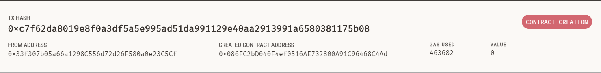

# If you want to run this in your WSL Visual Studio Code environment.
Hi! So first you need to install **wsl** in your environment. It lets you work on linux environment within your local environment.
- [WSL](https://docs.microsoft.com/en-us/windows/wsl/install)

After installing wsl, set username and password. Now open vscode and download an extension called **remote development**. Open command Palette and search *open in wsl window*. It will open vs code in wsl environment. Make a folder and run these commands in that folder's *terminal*.

## You need to follow these steps
### Compile the Smart Contract:
---
 1. Make a smart contract with *.sol* extenstion
 2. Install node js in your environment 
  - ``curl -o- https://raw.githubusercontent.com/nvm-sh/nvm/v0.39.1/install.sh | bash``
 
 3. Install yarn package manager | ``corepack enable``
 >You can use NPM package manager also for this job but i prefer yarn.
 4. Now to compile solidity smart contract, you need to install **solc**, to install it run this command => ``yarn add solc``
 
 6. If you want to install a particular version, you need a little bit different syntax, as I am using ``solidity 0.8.7`` version here so to install it using -> 
  - **```yarn add solc@0.8.7-fixed```**
 
 7. To *compile* smart contract :
  - ``yarn solcjs --bin --abi --include-path node_modules/ --base-path . -o . [contract-name]``

8. It will be hectic for us to type this heavy command whenver we want to compile our smart contract. So to reduce that work what we can do is we can edit our **package.json** file:
``` format solidity
"scripts": {
"compile": "yarn solcjs --bin --abi --include-path node_modules/ --base-path . -o . SimpleStorage.sol"
}
```
> Now whenever we type ``yarn compile`` in terminal, it will automatically run this command as long as I am in the same folder.

### Deploy the Smart Contract: 
---
#### Deploy in JavaScript Virtual Machine (Fake Blockchain)
For this section, I'll use a tool called **[Ganache](https://trufflesuite.com/ganache/)**, it is similar to virtual machine in *[Remix Ethereum IDE](https://remix-project.org/)*. We can run it locally to run, test and deploy smart contracts.
 > Open Ganache and just click on *quickstart*, it gives atleast 10 fake accounts with 100 eth each.
 1. Here [ethers.js](https://docs.ethers.io/v5/) comes into play, download it | ``yarn add ethers``

 3. Copy Ganache's RPC Server and private key of one of the account, use them in **deploy.js** file this way:
 ``` format javascript
const  ethers = require("ethers");
async  function  main() {
// http://0.0.0.0.7545 ganache rpc
// bd029ee8e1a69a8f64cf0ec081ab5335b442157b396a0589e2838bcefe54719e private key
const  provider = new  ethers.providers.JsonRpcProvider("http://127.0.0.1:7545");
const wallet = new ethers.Wallet("bd029ee8e1a69a8f64cf0ec081ab5335b442157b396a0589e2838bcefe54719e", provider);
}
```
> Using private key directly in code is not recommend but let's do it here :)

3. Now that we have provider and wallet, let's go and grab contract details from ***SimpleStorage_sol_SimpleStorage.abi*** and ***SimpleStorage_sol_SimpleStorage.bin*** files. To deploy our contract we need abi and bin data of the contract, so to read data from these files we are gonna need a package called **fs**.

5. On the top of *deploy.js* file add a line:
 ```format solidity
const fs = require("fs");
```

6. If package fs doesn't come with your *node_modules*, you can add it | ``yarn add fs ``

7. Now to read these two files, add these given lines in main function:
```format solidity
const  abi = fs.readFileSync("./SimpleStorage_sol_SimpleStorage.abi", "utf8");
const  bin = fs.readFileSync("./SimpleStorage_sol_SimpleStorage.bin", "utf8");
```
8. Now we can create something called contract factory. To deploy a [Contract](https://docs.ethers.io/v5/api/contract/contract/), additional information is needed that is not available on a Contract object itself. Mainly, the bytecode (more specifically the initcode) of a contract is required. [Contract Factory](https://docs.ethers.io/v5/api/contract/contract-factory/) does this job.

8. Add these lines in *deploy.js* **main()** function:
```format solidity
const  contractFactory = new  ethers.ContractFactory(abi, bin, wallet);
console.log("Delploying.....");
const  contract = await  contractFactory.deploy();
// await -> stop here, wait for the contract to deploy
console.log(contract);
```
<mark>Before deploying it</mark>, you need to do a little change in your ganache server.
**Quickstart < gear icon at top right < server tab < change the hostname with Wsl name on it**
> Check rpc server link and private key, they might have been changed.

9. Now to deploy this contract run a commaand | ``node deploy.js``

11. We can see in the transaction tab on ganache that we payed some gas fees for contract creation. 


11. You just deployed a contract on a locak blockchain whoa ! 😎
