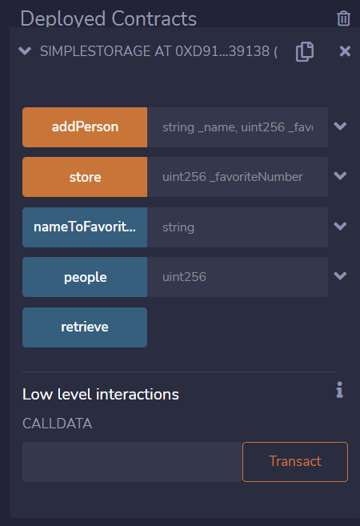

<div align="center">
  <a href="https://github.com/iamansingh0/web3/tree/master/ethers-simple-storage">
    <p align="center">
      
    </p>
  </a>
  <h3 align="center"><strong>Compile and Deploy Smart Contract Using ethers.js</strong></h3>
  <hr>
</div>
<details>
  <summary>Table of Contents</summary>
  <ol>
    <li>
      <a href="#about-the-project">About The Project</a>
      <ul>
        <li><a href="#built-with">Built With</a></li>
      </ul>
    </li>
    <li>
      <a href="#getting-started">Getting Started</a>
      <ul>
        <li><a href="#prerequisites-and-installation">Prerequisites and Installation</a></li>
        <li><a href="#what-does-this-contract-do">What does this contract do</a></li>
      </ul>
    </li>
    <li><a href="#steps-to-compile-the-smart-contract">Steps to Compile the Smart Contract</a></li>
    <li><a href="#deploy-the-smart-contract">Deploy the Smart Contract</a></li>
    <li><a href="#interact-with-simplestorage-smart-contract">Interact with SimpleStorage Smart Contract</a></li>
    <li><a href="#deploying-it-in-remix-ide">Deploying it in remix IDE</a></li>
    <li><a href="#to-read-or-write-the-contract-using-rinkeby-testnet">To Read or Write the contract using rinkeby testnet</a></li>
  </ol>
</details>
<hr>

## About the project
It is a very basic project for web3 beginners on how to deploy their smart contract using javascript's [ethers.js](https://docs.ethers.io/v5/). In this project, there is a smart contract called **SimpleStorage.sol**. By using step by step process you can compile and deploy your smart contract to a local blockchain (``ganache``) and on a testnet(``rinkeby``).
Let's get started! 

### Built With

<a href="https://docs.ethers.io/v5/"></a>
<a href="https://docs.soliditylang.org/en/v0.8.7/contracts.html"></a>
<a href="https://developer.mozilla.org/en-US/docs/Web/JavaScript"></a>

## Getting Started
So before getting started, I want you to make sure that while following all the steps you might get errors so don't let them stop you! Search your error in the `community` and in indexed platforms like **stackoverflow** and **stackEthExchange** etc!

### Prerequisites and Installation
As a prerequisites, you should atleast know how javascript syntaxes work. If you forget about them, I'll pinpoint some keywords that will be important in this project.
- async function()
- await
- require()
- Basic variable types and strings

You should know how to write smart contract in solidity, I guess if you are trying to deploy it than you must know solidity.

As we all know that linux environment is the best for programming and tasks, so for this project also I'll be using linux environment in your windows and macOS environemnt
So first you need to install **wsl** in your environment. It lets you work on linux environment within your local environment.
- [WSL](https://docs.microsoft.com/en-us/windows/wsl/install)

After installing wsl, set username and password. Now open vscode and download an extension called **remote development**. Open command Palette and search *open in wsl window*. It will open vs code in wsl environment. Make a folder and get started!

### What does this contract do

| Functions and Variables      | What they do |
| ----------- | ----------- |
| 1. ``uint256 favoriteNumber``     | `It is a global variable to store an uint256 number.       |
| 2. ``struct People`` | It is a struct and stores name and fav number.        |
| 3. ``People[]  public people``   | people Array of type People.        |
| 4. `mapping(string => uint256)  public nameToFavoriteNumber`   |  Mapping name to fav number.      |
| 5. ``function store(uint256)``  | It's a function that takes a number and update global variable favoriteNumber to it.        |
| 6. `function retrieve()`   | It's a view function, it returns the number stored in point 1. variable.       |
| 7. `function addPerson(name, favNum)` | It is used to fill the array and mapping.

## Steps to Compile the Smart Contract
---
Now we are all set then let's try to compile our smart contract first. To do that you must follow every step given below!
 1. Make a smart contract with *.sol* extenstion
 2. Install node js in your environment 
  - ``curl -o- https://raw.githubusercontent.com/nvm-sh/nvm/v0.39.1/install.sh | bash``
 
 3. Install yarn package manager | ``corepack enable``
 >You can use NPM package manager also for this job but i prefer yarn.
 4. Now to compile solidity smart contract, you need to install **solc**, to install it run this command => ``yarn add solc``
 
 6. If you want to install a particular version, you need a little bit different syntax, as I am using ``solidity 0.8.7`` version here so to install it using -> 
  - **```yarn add solc@0.8.7-fixed```**
 
 7. To *compile* smart contract :
  - ``yarn solcjs --bin --abi --include-path node_modules/ --base-path . -o . [contract-name]``

8. It will be hectic for us to type this heavy command whenver we want to compile our smart contract. So to reduce that work what we can do is we can edit our **package.json** file:
``` format solidity
"scripts": {
"compile": "yarn solcjs --bin --abi --include-path node_modules/ --base-path . -o . SimpleStorage.sol"
}
```
> Now whenever we type ``yarn compile`` in terminal, it will automatically run this command as long as I am in the same folder.

## Deploy the Smart Contract 
---
### Deploy in JavaScript Virtual Machine (Fake Blockchain)
For this section, I'll use a tool called **[Ganache](https://trufflesuite.com/ganache/)**, it is similar to virtual machine in *[Remix Ethereum IDE](https://remix-project.org/)*. We can run it locally to run, test and deploy smart contracts.
 > Open Ganache and just click on *quickstart*, it gives atleast 10 fake accounts with 100 eth each.
 1. Here [ethers.js](https://docs.ethers.io/v5/) comes into play, download it | ``yarn add ethers``

 3. Copy Ganache's RPC Server and private key of one of the account, use them in **deploy.js** file this way:
 ``` format javascript
const  ethers = require("ethers");
async  function  main() {
// http://0.0.0.0.7545 ganache rpc
// bd029ee8e1a69a8f64cf0ec081ab5335b442157b396a0589e2838bcefe54719e private key
const  provider = new  ethers.providers.JsonRpcProvider("http://127.0.0.1:7545");
const wallet = new ethers.Wallet("bd029ee8e1a69a8f64cf0ec081ab5335b442157b396a0589e2838bcefe54719e", provider);
}
```
> Using private key directly in code is not recommend but let's do it here :)

4. Let me tell you how to secure your key without exposing it like above code.
  - Add a package called `dotenv` in node modules | `yarn add dotenv`
  - Add this line in your js file above *main()* fuction
  ```format javascript
     require('dotenv').config();
  ```
  - Now create a new `.env` file and inside it write these two lines of code.
  ```format javascript
    PRIVATE_KEY = bd029ee8e1a69a8f64cf0ec081ab5335b442157b396a0589e2838bcefe54719e
    RpcURL = http://127.0.0.1:7545
  ```
  - Now edit the code from step 3 like this:
  ```format javascript
    const  provider = new  ethers.providers.JsonRpcProvider(process.env.RpcURL);
    const wallet = new ethers.Wallet(process.env.PRIVATE_KEY, provider);
    }
  ```
  - Add this .env file in `.gitignore` so you never commit it.
5. Now that we have provider and wallet, let's go and grab contract details from ***SimpleStorage_sol_SimpleStorage.abi*** and ***SimpleStorage_sol_SimpleStorage.bin*** files. To deploy our contract we need abi and bin data of the contract, so to read data from these files we are gonna need a package called **fs**.

6. On the top of *deploy.js* file add a line:
 ```format solidity
const fs = require("fs");
```

7. If package fs doesn't come with your *node_modules*, you can add it | ``yarn add fs ``

8. Now to read these two files, add these given lines in main function:
```format solidity
const  abi = fs.readFileSync("./SimpleStorage_sol_SimpleStorage.abi", "utf8");
const  bin = fs.readFileSync("./SimpleStorage_sol_SimpleStorage.bin", "utf8");
```
9. Now we can create something called contract factory. To deploy a [Contract](https://docs.ethers.io/v5/api/contract/contract/), additional information is needed that is not available on a Contract object itself. Mainly, the bytecode (more specifically the initcode) of a contract is required. [Contract Factory](https://docs.ethers.io/v5/api/contract/contract-factory/) does this job.

10. Add these lines in *deploy.js* **main()** function:
```format solidity
const  contractFactory = new  ethers.ContractFactory(abi, bin, wallet);
console.log("Delploying.....");
const  contract = await  contractFactory.deploy();
// await -> stop here, wait for the contract to deploy
console.log(contract);
```
<mark>Before deploying it</mark>, you need to do a little change in your ganache server.
**Quickstart < gear icon at top right < server tab < change the hostname with Wsl name on it**
> Check rpc server link and private key, they might have been changed.

11. Now to deploy this contract run a commaand | ``node deploy.js``

12. We can see in the transaction tab on ganache that we payed some gas fees for contract creation. 


### You just deployed a contract on a local blockchain whoa ! 😎

# Interact with SimpleStorage Smart Contract
Before starting interacting with this contract, I must tell you what this smart contract do!


## Deploying it in remix IDE
#### It will look like this:
---
<p align="center">
  
</p>

1. Give a number in store function's parameter, click store.
2. To view the favorite number, click retrieve.
3. In addPerson, we can store name with theri fav number and to them pass the index in people array, it will return its fav number.
4. If we pass index in nameToFavNumber, it will return name and their favNumber.

- #### store() and receive() Function:
```format javascript
// store() function: 
const  storeResponse = await  contract.store("69");
const  storeResponseReceipt = await  storeResponse.wait(1);
// Interact With the receive() function:
const  currentFavNumber = await  contract.retrieve();
console.log(`Current Favorite Number: ${currentFavNumber.toString()}`);
```
##### output: 
<p align="center">
  
</p>
<br />
